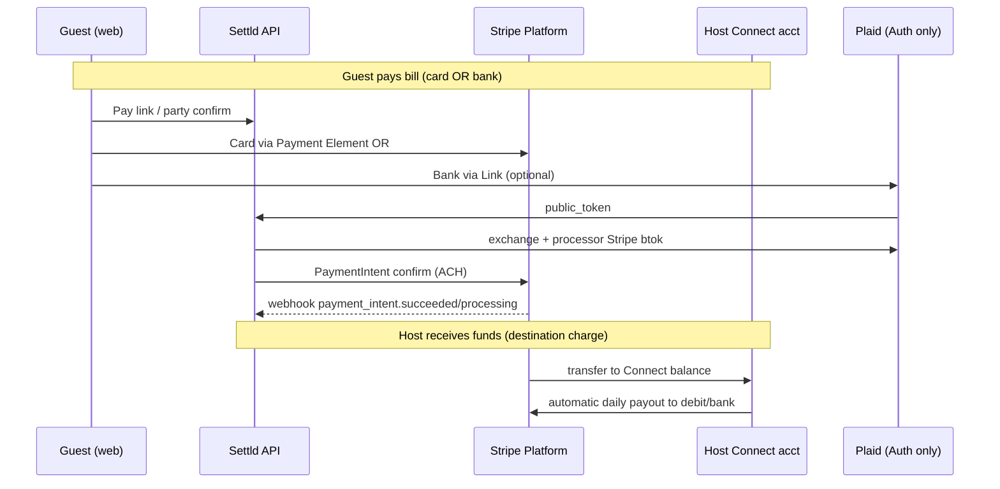

# DevOps: Stripe + Plaid pre-deployment checklist

Operational guide for deploying **Settld** payments: guest card/ACH pay, host Connect payouts (debit card + bank via Plaid), and webhooks.

**Audience:** DevOps / platform engineers configuring dashboards and production secrets before a release.

**Code references:** `backend/app/core/config.py`, `backend/app/api/routes/payments.py`, `backend/app/api/routes/stripe_connect.py`, `backend/app/api/routes/plaid.py`.

---

## Architecture (what you are wiring)



| Flow | Stripe surface | Plaid? |
|------|----------------|--------|
| Guest pays with **card** | Platform PaymentIntent + Payment Element | No |
| Guest pays with **bank (ACH)** | PaymentIntent `us_bank_account` + Plaid `btok_` | Yes (`auth` only) |
| Host **payout** destination | Connect Custom account external account | Yes (bank) or Stripe RN token (card/manual bank) |

**Important:** Cards never go through Plaid. Plaid Auth is $0 via partnership; Stripe still charges standard card/ACH processing fees.

---

## 1. Stripe Dashboard — account readiness

Do this on the **platform** Stripe account (not connected accounts).

### 1.1 Activate the business (Live mode)

1. [Stripe Dashboard](https://dashboard.stripe.com) → **Settings → Business**.
2. Complete identity, business profile, and bank account for the **platform** (where application fees land).
3. Confirm the account can accept **live** payments (toggle out of Test mode when validating live keys).

### 1.2 Enable payment methods

1. **Settings → Payment methods**.
2. Ensure **Cards** are enabled (required for guest checkout).
3. Enable **ACH Direct Debit** / **US bank accounts** for guest bank pay.
   - Complete any extra ACH compliance / capabilities Stripe requests.
4. **Connect** hosts still receive payouts to **debit card** or **US bank** attached as external accounts — no separate Plaid setup inside Stripe for that path.

### 1.3 Stripe Connect

1. **Connect → Settings**.
2. Use **Custom** connected accounts (the app collects KYC in-app and uses `Account.modify` + external accounts).
3. **Payout schedule:** default **daily automatic** (the app does not trigger manual payouts).
4. Confirm **US** is allowed for connected accounts.

### 1.4 Connect redirect URLs (browser onboarding fallback)

The API serves these routes (must be reachable over HTTPS in production):

| Purpose | Production URL (example) | Env var |
|---------|------------------------|---------|
| Success return | `https://api.settld.live/stripe/connect/return` | `CONNECT_RETURN_URL` |
| Expired / refresh | `https://api.settld.live/stripe/connect/refresh` | `CONNECT_REFRESH_URL` |

Set `CONNECT_RETURN_URL` and `CONNECT_REFRESH_URL` in production `.env` to match your API host. Mobile `expo-web-browser` closes when it hits these URLs.

---

## 2. Stripe Dashboard — API keys

1. **Developers → API keys**.
2. Copy for each environment:

| Secret / key | Env var | Where it goes |
|--------------|---------|---------------|
| Publishable key `pk_live_…` / `pk_test_…` | `STRIPE_PUBLISHABLE_KEY` | API (returned to web pay pages), optional `VITE_STRIPE_PUBLISHABLE_KEY`, mobile Stripe SDK |
| Secret key `sk_live_…` / `sk_test_…` | `STRIPE_SECRET_KEY` | **API only** — never commit to mobile/web bundles |

3. Use **live** keys only in production; **test** keys in staging.

**Security:** Rotate keys if exposed. Restrict who can view live secret keys in Stripe team settings.

---

## 3. Stripe Dashboard — webhooks (two endpoints)

The app registers **two** webhook endpoints. Each has its **own** signing secret. Do not reuse the same secret for both.

### 3.1 Platform payments webhook (guest charges)

| Field | Value |
|-------|--------|
| **URL** | `https://api.<your-domain>/payments/webhooks/stripe` |
| **Listen to** | Events on your **platform** account |
| **Signing secret** | → `STRIPE_WEBHOOK_SECRET` |

**Subscribe to these events (minimum):**

| Event | Why |
|-------|-----|
| `payment_intent.succeeded` | Mark guest payment paid; update member status |
| `payment_intent.processing` | ACH in flight — show “processing” in UI |
| `payment_intent.payment_failed` | Mark payment failed |

Optional but useful: `charge.refunded`, `charge.dispute.created` (not handled in app today — add handlers if you need them).

### 3.2 Connect webhook (host accounts & payouts)

| Field | Value |
|-------|--------|
| **URL** | `https://api.<your-domain>/stripe/connect/webhook` |
| **Listen to** | Events on **Connected accounts** (enable “Connect” / account events) |
| **Signing secret** | → `STRIPE_CONNECT_WEBHOOK_SECRET` |

**Subscribe to these events (minimum):**

| Event | Why |
|-------|-----|
| `account.updated` | Refresh `charges_enabled` / `payouts_enabled` cache for hosts |
| `payout.paid` | Payout history / arrival in app |
| `payout.failed` | Surface failed host payouts |
| `payout.canceled` | Sync payout status |
| `payout.updated` | Sync payout status |

### 3.3 Webhook deployment tips

- Endpoint must return **2xx** quickly; Stripe retries on 5xx.
- Use Stripe CLI for staging smoke tests:
  ```bash
  stripe listen --forward-to localhost:8000/payments/webhooks/stripe
  stripe listen --forward-connect-to localhost:8000/stripe/connect/webhook
  ```
- After creating each endpoint in the Dashboard, copy the **Signing secret** (`whsec_…`) into secrets manager / `.env` immediately.

---

## 4. Stripe Dashboard — destination charges (guest → host)

Guest payments use **destination charges** when the bill host has a Connect account with `charges_enabled`:

- `transfer_data.destination` = host `acct_…`
- `application_fee_amount` = Settld service fee slice (see `SERVICE_FEE_PERCENTAGE` / bill `service_fee` in config)

**Before go-live, verify in Test mode:**

1. Onboard a test host (Connect Custom + debit card or Plaid bank).
2. Create a bill, open guest pay link, pay with **card**.
3. In Stripe → **Payments**, confirm:
   - Charge succeeded on platform.
   - Transfer to connected account present.
   - Application fee on platform balance (if configured).

4. Repeat with **ACH** (test bank via Plaid sandbox) and confirm `payment_intent.processing` → `succeeded`.

If destination + `us_bank_account` fails in test, check Connect capabilities and contact Stripe support before enabling `PLAID_ENABLED` in production.

---

## 5. Plaid Dashboard — before enabling bank flows

Only needed when `PLAID_ENABLED=true`.

### 5.1 Products & partnership

1. [Plaid Dashboard](https://dashboard.plaid.com) → **Team Settings → Keys**.
2. Use **Sandbox** keys for staging; **Production** keys for live.
3. Enable product: **Auth** only (required for Stripe processor token path; do not enable Transactions/Balance for this integration).
4. Confirm **Stripe processor integration** is enabled (Plaid → integrate with Stripe so `/processor/stripe/bank_account_token/create` works).

### 5.2 Allowed redirect URIs (web guest bank pay)

For OAuth institutions on web pay pages:

1. Plaid Dashboard → **API → Allowed redirect URIs**.
2. Add production pay origin, e.g.:
   - `https://pay.settld.live`
   - Or a dedicated path if you use one consistently.

Set the same value in API env:

```bash
PLAID_REDIRECT_URI=https://pay.settld.live
```

### 5.3 Plaid env vars (API)

| Variable | Example | Notes |
|----------|---------|--------|
| `PLAID_CLIENT_ID` | From Plaid dashboard | API only |
| `PLAID_SECRET` | Sandbox or production secret | API only |
| `PLAID_ENV` | `sandbox` or `production` | Must match key type |
| `PLAID_PRODUCTS` | `["auth"]` | JSON array in `.env` |
| `PLAID_ENABLED` | `true` / `false` | Feature flag — start `false`, enable after smoke tests |
| `PLAID_REDIRECT_URI` | Web pay origin | Web ACH OAuth |

---

## 6. Production environment variables (API)

Minimum payment-related set:

```bash
# Stripe (required for real money)
STRIPE_SECRET_KEY=sk_live_...
STRIPE_PUBLISHABLE_KEY=pk_live_...
STRIPE_WEBHOOK_SECRET=whsec_...          # /payments/webhooks/stripe
STRIPE_CONNECT_WEBHOOK_SECRET=whsec_...  # /stripe/connect/webhook

# Connect browser redirects (HTTPS API host)
CONNECT_RETURN_URL=https://api.settld.live/stripe/connect/return
CONNECT_REFRESH_URL=https://api.settld.live/stripe/connect/refresh

# Platform fee fallback (bps); per-bill service_fee usually drives guest UI
PLATFORM_FEE_BPS=0
SERVICE_FEE_PERCENTAGE=4.9

# Plaid (optional — bank pay + Plaid bank payouts)
PLAID_ENABLED=false
PLAID_CLIENT_ID=...
PLAID_SECRET=...
PLAID_ENV=production
PLAID_PRODUCTS=["auth"]
PLAID_REDIRECT_URI=https://pay.settld.live

ENVIRONMENT=production
JWT_SECRET_KEY=<strong-random>   # required when ENVIRONMENT=production
```

Also ensure **CORS** allows pay web origin (`CORS_ORIGINS` / `CORS_ORIGIN_REGEX` in `config.py`).

---

## 7. Client apps (no secrets on device)

| App | Variable | Value |
|-----|----------|--------|
| Web pay (`web/app`) | `VITE_API_BASE_URL` | `https://api.settld.live` |
| Web pay | `VITE_STRIPE_PUBLISHABLE_KEY` | Optional fallback; API usually returns `stripe_publishable_key` on pay load |
| React Native | `EXPO_PUBLIC_API_URL` | Production API URL |
| React Native | Stripe publishable key | Configured in `App.js` / EAS secrets — **publishable only** |

**Never** put `sk_live_`, `whsec_`, or `PLAID_SECRET` in frontend bundles.

**React Native Plaid:** requires native build (`expo prebuild` / EAS). Plaid Link does not run in Expo Go alone.

---

## 8. Suggested rollout order

1. **Staging (Stripe test mode)**
   - Deploy API with test keys + both webhooks (Stripe CLI or Dashboard test endpoints).
   - Card guest pay end-to-end.
   - Connect host onboarding + card payout.
2. **Staging + Plaid sandbox**
   - `PLAID_ENABLED=true`, `PLAID_ENV=sandbox`.
   - Host: Plaid bank on Setup Payouts.
   - Guest: Bank tab on pay page; confirm `processing` → `succeeded`.
3. **Production**
   - Switch to live Stripe keys and production Plaid keys.
   - Create **new** live webhook endpoints; update secrets.
   - `PLAID_ENABLED=true` only after step 2 passes.
4. **Monitor**
   - API logs: `event=plaid.*`, `stripe_connect_webhook_received`, payment webhook logs.
   - Stripe Dashboard → **Developers → Webhooks** for delivery failures.

---

## 9. Post-deploy smoke tests

| # | Test | Pass criteria |
|---|------|----------------|
| 1 | `GET /health` | `database: connected` |
| 2 | Guest card pay | PaymentIntent succeeds; member `paid`; Connect transfer visible |
| 3 | Guest ACH pay (if Plaid on) | PI `processing` then `succeeded`; webhook updates status |
| 4 | Host Connect setup | `payouts_enabled` or clear requirements; external account last4 shown |
| 5 | Host Plaid bank | `/plaid/complete-payout` → bank last4 on status |
| 6 | Webhook replay | Stripe Dashboard “Send test webhook” → API 200 |
| 7 | Pay link TTL | Expired link returns 410 (`PAY_LINK_TTL_MINUTES`) |

---

## 10. Common failures

| Symptom | Likely cause | Fix |
|---------|----------------|-----|
| `WEBHOOK_NOT_CONFIGURED` 503 | Missing `STRIPE_WEBHOOK_SECRET` | Set secret from Dashboard endpoint |
| Connect status never updates | Wrong webhook or missing `STRIPE_CONNECT_WEBHOOK_SECRET` | Separate Connect endpoint + connected-account events |
| Webhook signature invalid | Secret mismatch or wrong endpoint body | Re-copy `whsec_` for that exact URL |
| Guest pay works but host gets $0 | Host not onboarded / `charges_enabled` false | Complete Connect KYC; check `account.updated` webhook |
| `PLAID_DISABLED` 503 | `PLAID_ENABLED=false` | Enable flag + Plaid keys after dashboard setup |
| `PLAID_STRIPE_TOKEN_FAILED` | Stripe processor not linked in Plaid | Enable Stripe integration in Plaid Dashboard |
| ACH stuck on “processing” | Normal for 1–3 business days | Ensure `payment_intent.processing` webhook subscribed |
| Bank pay works in test, not live | Live Plaid + live Stripe mismatch | Use production Plaid keys with live Stripe |

---

## 11. Quick reference — URLs to register

Replace `api.settld.live` / `pay.settld.live` with your hosts.

| System | URL |
|--------|-----|
| Stripe platform webhook | `https://api.settld.live/payments/webhooks/stripe` |
| Stripe Connect webhook | `https://api.settld.live/stripe/connect/webhook` |
| Connect return | `https://api.settld.live/stripe/connect/return` |
| Connect refresh | `https://api.settld.live/stripe/connect/refresh` |
| Public guest pay (web) | `https://pay.settld.live/pay/{token}` |
| Plaid redirect (web) | `https://pay.settld.live` (or path configured in `PLAID_REDIRECT_URI`) |

---

## 12. Related docs

- Backend API overview: `backend/README.md`
- Web pay app: `web/app/README.md`
- Local perf demo (unrelated to payments): `scripts/DEMO_PERF.md`

For application-level payment behavior (fees, async parse, Celery), see code comments in `payment_service.py` and `stripe_connect_service.py`.
